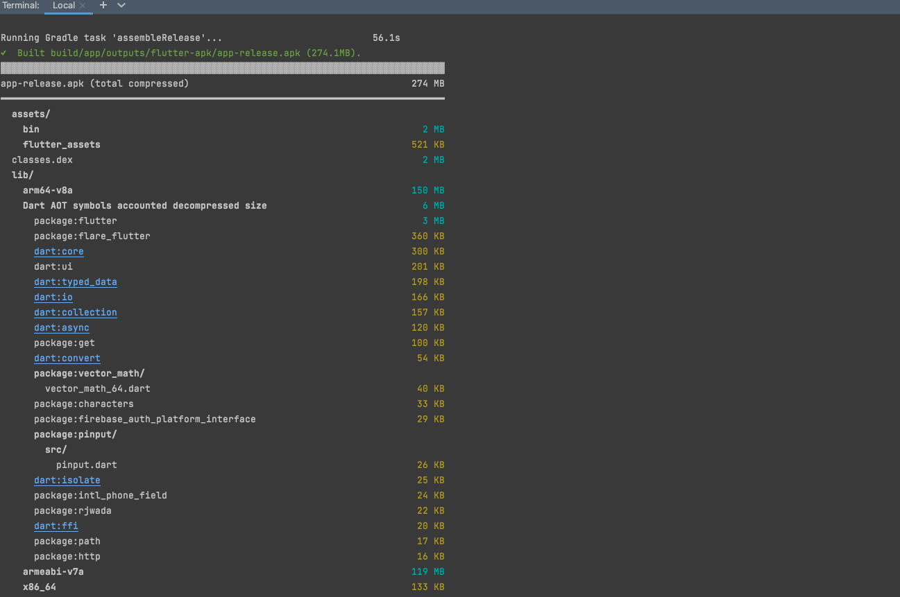

# rjwada
#- [Rajwada apk](https://drive.google.com/file/d/1cPEL2cRKQsMJO1wx2OX5iCR3S7ykE0iT/view?usp=sharing)

## Getting Started

### The app size is big because of the unity integration. rest the app size comes down to 18mb.
The app was made using flutter and unity integration as a sample

If you want to run this. you will probably need andriod NDK location from unity build settings

